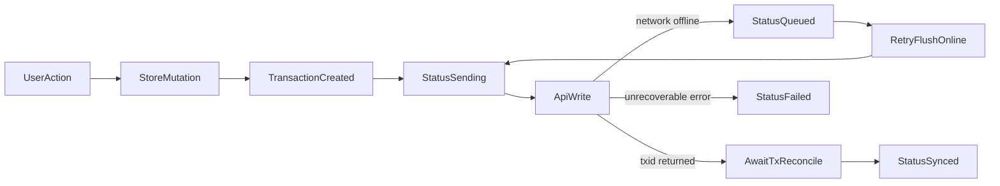

# Header Outbox With Transaction Status

## Scope

Implement an outbox in the authenticated app header using a status chip + panel pattern, showing per-transaction lifecycle: `Queued -> Sending -> Synced -> Failed`.

## Files To Update

- [resources/js/AppShell.vue](/var/www/html/resources/js/AppShell.vue) — add header outbox trigger/chip and panel list UI.
- [resources/js/store/todos.store.js](/var/www/html/resources/js/store/todos.store.js) — expose reactive outbox entries and helper actions for status updates.
- [resources/js/services/todos.sync.js](/var/www/html/resources/js/services/todos.sync.js) — emit transaction lifecycle events from optimistic handlers and pending mutation flush loop.
- [resources/js/utilities/i18n\*](/var/www/html/resources/js) — add labels for outbox title, statuses, and empty/error text in existing locale message files.

## Implementation Approach

1. Add a lightweight outbox state model in the todos store:
   - `outboxEntries` (reactive array keyed by transaction id), each entry containing `id`, `type`, `todoId`, `title`, `status`, `createdAt`, `updatedAt`, and optional `error`.
   - status helpers (`markQueued`, `markSending`, `markSynced`, `markFailed`) and cleanup policy (retain recent synced items briefly so the user can see completion).
2. Extend sync service to publish lifecycle transitions:
   - When a mutation is queued offline in `queuePendingMutation`, record `Queued`.
   - Before API call in `onInsert`/`onUpdate`/`onDelete` and `runPendingMutation`, mark `Sending`.
   - On `txid` acceptance and reconciliation completion, mark `Synced`.
   - On unrecoverable exception paths, mark `Failed` with message.
3. In store mutation entry points (`createTodo`, `toggleTodo`, `removeTodo`), connect TanStack transaction persistence (`transaction.isPersisted.promise`) to finalize status and keep error handling aligned with current behavior.
4. Render header UI in `AppShell.vue`:
   - Add outbox chip/button near existing toolbar controls.
   - Open a panel/menu showing transaction rows, latest first, with status badge and optional error detail.
   - Show count badge for active non-synced items.
5. Add i18n strings for outbox labels/statuses and keep existing translation utility usage.
6. Validate behavior manually with online + offline mutation scenarios and ensure status transitions are visible and deterministic.

## Data Flow

## Notes

- Reuse existing sync primitives instead of introducing a second mutation queue.
- Keep the outbox generic enough to support additional collections later, but implement only todos in this change.
