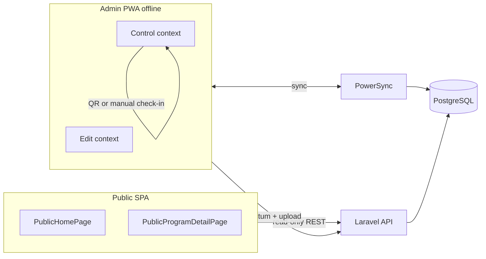

# Billet Bateau

Local-first **program operations + public booking** platform for seasonal boat activities. Staff use an offline-capable admin PWA (Quasar + TanStack DB + PowerSync); guests use a public catalog and checkout without payment in v1.

**Stack:** Laravel 13 API · Vue 3 · Quasar · PostgreSQL + PostGIS · Redis · PowerSync · Garage (S3) · Docker Compose (Sail dev / `deploy/` prod).

**Health (2026-05-31):** `191` PHPUnit tests passing. **Target launch:** week of 2026-06-07 (staging install in progress). Schema changes are **new migrations only** (live DB).

---

## Project status (PM view)

### v1 launch decisions (locked 2026-05-31)

| Topic              | Decision                                                                                                                                              |
| ------------------ | ----------------------------------------------------------------------------------------------------------------------------------------------------- |
| **Launch**         | Next week; **staging** environment being installed now (`deploy/` + `staging` branch `config`)                                                        |
| **Locales**        | **French only** for v1 (UI + booking email)                                                                                                           |
| **Tenancy**        | **Multi-program** — users see programs via `program_user`; no change needed for v1                                                                    |
| **Payment**        | **None** — reservations only                                                                                                                          |
| **Admin contexts** | **Two for v1:** **Edit** (catalog/schedule) + **Control** (day ops). **No separate check-in context** — routes/layout may remain but are out of v1 UX |
| **Check-in UX**    | Lives in **Control** only: associate bookings to a _Départ_ via **QR scan** or **manual check-in** button                                             |
| **Guides**         | **Required for v1** — admin CRUD + PowerSync uplink (sync down already exists)                                                                        |
| **`check_ins`**    | **Required** — one row per booking per voyage; PowerSync sync + uplink; backs control-panel check-in                                                  |
| **Staff roles**    | **None** — any authenticated program member can do all admin ops                                                                                      |
| **Voyage start**   | **Manual only** — staff start a _Départ_ from the control board                                                                                       |
| **Offline**        | Control + edit must work offline for synced data via PowerSync                                                                                        |

### What “v1” means (technical)

| Decision            | Choice                                                                         |
| ------------------- | ------------------------------------------------------------------------------ |
| Check-in data model | `check_ins` (booking ↔ voyage) + `passengers` (one row per person on manifest) |
| Voyage lifecycle    | Client → PowerSync upload (no REST `startVoyage` / `markArrived`)              |

### Feature matrix

| Area                                 | Status                 | Notes                                                                                                                  |
| ------------------------------------ | ---------------------- | ---------------------------------------------------------------------------------------------------------------------- |
| **Public catalog**                   | Done                   | `GET /api/public/programs`, program detail by `slug`                                                                   |
| **Public booking (no payment)**      | Done                   | Trip → tickets → contact; capacity, ticket min/max, dependency ratio, custom questions; confirmation email (FR)        |
| **Program edit context**             | Done                   | Program, boats, **products** (catalog SKU: boat type + _parcours_ + media), ticket types, template days, trip calendar |
| **_Parcours_ (water routes)**        | Done                   | Leaflet polyline editor in product/water-route dialogs; PowerSync sync + uplink                                        |
| **PowerSync (sync + uplink)**        | Mostly done            | See [Synced data](#synced-data) — `check_ins` and guide **writes** not wired                                           |
| **Control context (ops + check-in)** | In progress            | Day board, _Départ_, manifest, walk-ins — **missing:** QR check-in, manual check-in button, `check_ins` workflow       |
| **Check-in context (separate)**      | **Dropped v1**         | Do not ship; hide nav links if needed — all check-in in Control                                                        |
| **Guides**                           | **Blocked for launch** | Synced read-only; need edit-context CRUD + uplink                                                                      |
| **`check_ins` + QR**                 | **Blocked for launch** | DB exists; not in PowerSync; no QR encode/scan on booking reference yet                                                |
| **HTTP voyage API**                  | Not in v1              | Voyage lifecycle via PowerSync upload                                                                                  |
| **i18n**                             | Partial                | Finish **French-only** pass on control + new check-in/guide screens                                                    |
| **Payment / PWYC amounts**           | Out of v1              | PWYC label only; no amount capture                                                                                     |

### Sprint backlog (launch week)

Priority order for **staging → production** next week:

| #   | Work item                                                                                                                               | Owner hint |
| --- | --------------------------------------------------------------------------------------------------------------------------------------- | ---------- |
| 1   | **Staging smoke** — compose up, migrate, `storage:configure`, PowerSync URL, mail test booking                                          | Ops        |
| 2   | **`check_ins` PowerSync** — add to `sync-config.yaml`, client collection, `ApplyCheckInPowerSyncCrudAction`, tests                      | Backend    |
| 3   | **Control: manual check-in** — pick booking on trip card → create `check_ins` + manifest `passengers` from `booking_tickets`            | Frontend   |
| 4   | **Control: QR check-in** — booking reference in confirmation (email/UI); scanner on control board resolves booking → same check-in path | Full stack |
| 5   | **Guides CRUD** — edit-context list/create/edit, uplink `guides`, French copy                                                           | Full stack |
| 6   | **Hide check-in context** — remove/hide `checkin-context` nav; document two-context v1                                                  | Frontend   |
| 7   | **French pass** — control, guides, check-in strings; drop or ignore EN for launch                                                       | Frontend   |
| 8   | **E2E dry run** — public book → control board → QR or manual check-in → _Départ_ → arrive; offline replay                               | QA         |

**Launch gate:** items 1–5 + 8 green on staging; 6–7 before prod cutover.

Deferred past v1: separate check-in context, payment, PWYC amounts, per-passenger checkout, EN locale, schedule overrides.

### Reference plans

| Document                                                                                                                                     | Purpose                                                   |
| -------------------------------------------------------------------------------------------------------------------------------------------- | --------------------------------------------------------- |
| [`docs/superpowers/plans/2026-05-27-public-booking-flow-completion.md`](docs/superpowers/plans/2026-05-27-public-booking-flow-completion.md) | Public booking — **complete** (phases 0–3)                |
| [`AGENTS.md`](AGENTS.md)                                                                                                                     | Agent/dev conventions (Laravel Boost, PowerSync pitfalls) |

---

## Architecture



| Bundle     | Entry                              | Auth            |
| ---------- | ---------------------------------- | --------------- |
| **Public** | `/`, `/programs/:slug`             | None            |
| **Admin**  | `/programs`, program-scoped routes | Sanctum session |

**PowerSync streams** (`deploy/config/powersync/sync-config.yaml`):

- `user_scope` (auto) — programs list, `guides` (read)
- `program_scope` — requires `program_id` from router (`activeProgramIdRef`); all program ops data

If `program_scope` never subscribes, program data stays empty — see `resources/js/powersync/app-powersync.runtime.ts` and router guard `meta.requiresSelectedProgram`.

### Synced data

**Downlink (representative):** `programs`, `boat_types`, `boats`, `products`, `trips`, `water_routes`, template stack, `ticket_types`, `bookings`, `booking_tickets`, `voyages`, `voyage_boat`, `voyage_guide`, `passengers`, `check_ins`, `guides`.

**Uplink** (`POST /api/powersync/upload`, types in `App\PowerSync\PowerSyncCrudType`): programs, products, boats, boat types, trips, water routes, templates, ticket types, **bookings**, booking tickets, **voyages**, voyage_boat, voyage_guide, **passengers**, **guides**, **check_ins**.

Staff walk-ins and check-in bookings use uplink `bookings` from control panel; public guests use `POST /api/public/…/bookings`.

### Program admin contexts (v1)

After selecting a program, staff use **two** contexts:

| Context     | URL                           | Purpose                                                                                      |
| ----------- | ----------------------------- | -------------------------------------------------------------------------------------------- |
| **Edit**    | `/programs/:id/edit-context/` | Catalog & schedule: program, boats, products, **guides**, ticket types, template days, trips |
| **Control** | `…/control-context/control`   | Day ops: board, _Départs_, **check-in** (QR + manual), manifest, walk-ins                    |

`checkin-context` routes exist in code but are **not part of v1** — check-in ships only inside Control.

Context layouts set shell behavior (nav, program switch policy) via Pinia `appLayout` while mounted.

### Domain model (short)

- **Program** — season/event container; `slug` for public URLs; `booking_questions` JSON for checkout.
- **Product** — sellable offering: links `boat_type_id` + `water_route_id` (+ banner). **Trip** references `product_id` (not boat type directly).
- **Trip** (_Sortie_) — concrete departure: `scheduled_departure_at`, capacity; optional `template_day_slot_id` (provenance only).
- **WaterRoute** (_Parcours_) — reusable PostGIS `LineString` + `duration_minutes`.
- **Voyage** (_Départ_) — on-water execution; optional `trip_id`; required `water_route_id` (may differ from trip’s planned route).
- **Booking** / **booking_tickets** — reservation + line items; ticket dependency rules on `ticket_types`.

**French UI terms (code stays English):**

| Model        | Fr (i18n)          |
| ------------ | ------------------ |
| `Boat`       | Embarcation        |
| `BoatType`   | Type d'embarcation |
| `WaterRoute` | Parcours           |
| `Trip`       | Sortie             |
| `Voyage`     | Départ             |

### Ticket dependency ratio

Configured per `ticket_types` (`depends_on_ticket_type_id`, `max_per_reference_ticket`). Validated in `CreatePublicBookingAction` and `public-booking-validation.ts`. Example: max 2 child tickets per 1 adult in cart.

---

## Local development

```bash
cp .env.example .env
php artisan key:generate
# Sail (see compose.yaml): docker compose up -d
php artisan migrate
npm install && npm run dev
```

Tests: `php artisan test --compact` (uses `DB_DATABASE=testing`; PostGIS extension required for geometry tests).

PowerSync + Garage + Mailpit ports: see [Compose-only variables](#compose-only-not-laravel) below.

---

## Deployment

Production: Docker Compose under `deploy/` (`deploy/compose.yaml`, `deploy/.env.example`).

`deploy/compose.yaml` bind-mounts `./config` (Garage, Postgres init, PowerSync, PostGIS). That tree is maintained on the [`staging` branch](https://github.com/marcag3/billet-bateau/tree/staging/deploy/config) — fetch before `docker compose up`:

```bash
# From deploy/ — Option A: svn export
svn export https://github.com/marcag3/billet-bateau/branches/staging/deploy/config config

# Option B: tarball from repo root
curl -fsSL https://codeload.github.com/marcag3/billet-bateau/tar.gz/refs/heads/staging \
  | tar -xz billet-bateau-staging/deploy/config
mv billet-bateau-staging/deploy/config deploy/config
rm -rf billet-bateau-staging
```

Then `deploy/.env` from `deploy/.env.example`, set `PRODUCTION_IMAGE` and secrets (`openssl rand -hex 16`, `openssl rand -base64 48` for `POWERSYNC_JWT_SECRET`).

```bash
cd deploy && docker compose pull && docker compose up -d
docker compose exec production php artisan migrate --force
```

Garage bucket website + CORS (`AWS_CORS_ALLOWED_ORIGINS`) are applied when the `production` container starts (`deploy/entrypoint.d/60-startup.sh`). Re-run manually after changing CORS origins:

```bash
docker compose exec production php artisan storage:configure --no-interaction
```

### CI (`.github/workflows/build.yml`)

Push to `main` → production image + Sentry release (Laravel + Vue) tagged with commit SHA. Repository secrets: `SENTRY_AUTH_TOKEN`, `SENTRY_ORG`, `SENTRY_LARAVEL_PROJECT`, `SENTRY_VUE_PROJECT`, `VITE_SENTRY_DSN`. Set `SENTRY_LARAVEL_DSN` in `deploy/.env`.

---

## Configuration

Environment files hold **secrets** and **per-environment URLs**. Other values default from `config/*.php` or Compose.

Copy `.env.example` → `.env` (Sail). Copy `deploy/.env.example` → `deploy/.env` (prod). Run `php artisan key:generate` after creating `.env`.

### Required

| Variable                   | Dev | Production | Notes                               |
| -------------------------- | --- | ---------- | ----------------------------------- |
| `APP_KEY`                  | ✓   | ✓          | `php artisan key:generate`          |
| `DB_DATABASE`              | ✓   | ✓          | Postgres container                  |
| `DB_USERNAME`              | ✓   | ✓          |                                     |
| `DB_PASSWORD`              | ✓   | ✓          |                                     |
| `AWS_ACCESS_KEY_ID`        | ✓   | ✓          | Garage S3 (≥ 8 chars dev)           |
| `AWS_SECRET_ACCESS_KEY`    | ✓   | ✓          |                                     |
| `AWS_URL`                  | ✓   | ✓          | Public object URL (Garage s3_web)   |
| `AWS_ENDPOINT_PUBLIC`      | ✓   | ✓          | Presigned upload host               |
| `PRODUCTION_IMAGE`         |     | ✓          | `deploy/.env` only                  |
| `APP_URL`                  |     | ✓          | HTTPS                               |
| `SANCTUM_STATEFUL_DOMAINS` |     | ✓          | SPA host(s), comma-separated        |
| `POWERSYNC_PUBLIC_URL`     |     | ✓          | Browser PowerSync URL               |
| `POWERSYNC_JWT_SECRET`     |     | ✓          | HS256; must match PowerSync service |
| `MAIL_HOST`                |     | ✓          | Booking confirmation email          |

### Injected by Docker Compose

Usually omit from `.env`:

| Variable       | Dev (`laravel.test`) | Production (`production`\*)         |
| -------------- | -------------------- | ----------------------------------- |
| `DB_HOST`      | `pgsql`              | `pgsql`                             |
| `REDIS_HOST`   | `redis`              | `redis`                             |
| `AWS_ENDPOINT` | `http://garage:3900` | default in `config/filesystems.php` |
| `MAIL_*`       | Mailpit              | —                                   |

\*Also `production-schedule`, `production-queue`. PowerSync Postgres URIs default from `DB_*`.

### Optional overrides

| Variable                       | Default                 | Config                   |
| ------------------------------ | ----------------------- | ------------------------ |
| `APP_NAME`                     | `Laravel`               | `config/app.php`         |
| `APP_ENV`                      | `production`            | `config/app.php`         |
| `APP_DEBUG`                    | `false`                 | `config/app.php`         |
| `APP_URL`                      | `http://localhost`      | `config/app.php`         |
| `DB_CONNECTION`                | `pgsql`                 | `config/database.php`    |
| `DB_HOST`                      | `127.0.0.1`             | `config/database.php`    |
| `DB_PORT`                      | `5432`                  | `config/database.php`    |
| `SESSION_DRIVER`               | `redis`                 | `config/session.php`     |
| `QUEUE_CONNECTION`             | `redis`                 | `config/queue.php`       |
| `CACHE_STORE`                  | `redis`                 | `config/cache.php`       |
| `FILESYSTEM_DISK`              | `s3`                    | `config/filesystems.php` |
| `REDIS_HOST`                   | `127.0.0.1`             | `config/database.php`    |
| `AWS_DEFAULT_REGION`           | `garage`                | `config/filesystems.php` |
| `AWS_BUCKET`                   | `app`                   | `config/filesystems.php` |
| `AWS_USE_PATH_STYLE_ENDPOINT`  | `true`                  | `config/filesystems.php` |
| `AWS_CORS_ALLOWED_ORIGINS`     | `*`                     | `config/filesystems.php` |
| `POWERSYNC_PUBLIC_URL`         | `http://localhost:6080` | `config/powersync.php`   |
| `POWERSYNC_JWT_SECRET`         | dev placeholder         | `config/powersync.php`   |
| `POWERSYNC_JWT_KID`            | `local-dev`             | `config/powersync.php`   |
| `POWERSYNC_JWT_AUDIENCE`       | `powersync-dev`         | `config/powersync.php`   |
| `SANCTUM_STATEFUL_DOMAINS`     | localhost + host        | `config/sanctum.php`     |
| `MAIL_MAILER`                  | `log`                   | `config/mail.php`        |
| `MAIL_FROM_ADDRESS`            | `hello@example.com`     | `config/mail.php`        |
| `SENTRY_LARAVEL_DSN`           | disabled                | `config/sentry.php`      |
| `SENTRY_RELEASE`               | image `github.sha`      | `config/sentry.php`      |
| `SENTRY_ENVIRONMENT`           | `production` in image   | `config/sentry.php`      |
| `SENTRY_TRACES_SAMPLE_RATE`    | —                       | `config/sentry.php`      |
| `VITE_SENTRY_DSN`              | disabled                | `resources/js/sentry.ts` |
| `VITE_SENTRY_RELEASE`          | image `github.sha`      | `resources/js/sentry.ts` |
| `VITE_SENTRY_SEND_DEFAULT_PII` | `true`                  | `resources/js/sentry.ts` |
| `MEDIA_TRUSTED_ORIGINS`        | —                       | `config/media.php` (extra SW image origins) |

### Compose-only (not Laravel)

Root `compose.yaml` port forwards:

| Variable                         | Default |
| -------------------------------- | ------- |
| `APP_PORT`                       | `80`    |
| `VITE_PORT`                      | `5173`  |
| `FORWARD_DB_PORT`                | `5432`  |
| `FORWARD_REDIS_PORT`             | `6379`  |
| `FORWARD_POWERSYNC_PORT`         | `6080`  |
| `FORWARD_GARAGE_PORT`            | `9000`  |
| `FORWARD_GARAGE_WEB_PORT`        | `8900`  |
| `FORWARD_MAILPIT_PORT`           | `1025`  |
| `FORWARD_MAILPIT_DASHBOARD_PORT` | `8025`  |
| `WWWUSER` / `WWWGROUP`           | `1000`  |

Production startup runs `storage:configure` (see `deploy/entrypoint.d/60-startup.sh`); set `AWS_CORS_ALLOWED_ORIGINS` to your SPA origin(s).

Tests: `DB_DATABASE=testing`; DB created by `deploy/config/pgsql/create-testing-databases.sql` — run `CREATE EXTENSION postgis;` there if geometry tests fail.

---

## Key code locations

| Concern          | Location                                                               |
| ---------------- | ---------------------------------------------------------------------- |
| Public API       | `routes/api.php`, `PublicProgramController`, `PublicBookingController` |
| PowerSync upload | `PowerSyncUploadController`, `app/Actions/PowerSync/*`                 |
| Sync SQL         | `deploy/config/powersync/sync-config.yaml`                             |
| Admin router     | `resources/js/router/index.ts`                                         |
| Control panel    | `AppProgramControlPanelPage.vue`, `useControlPanel*` composables       |
| Public checkout  | `PublicProgramDetailPage.vue`, `public-booking-validation.ts`          |
| Collections      | `resources/js/powersync/*.collection.ts`                               |

---

## Backlog (condensed)

### Done (high level)

- Architecture: edit + control contexts (+ legacy check-in routes unused in v1)
- PowerSync infrastructure + program-scoped sync for catalog and ops entities
- Public read-only catalog + guest booking + confirmation email
- Admin: programs, boats, products, ticket types, templates, trip calendar, water routes (map editor)
- Control panel: day board, voyage start/arrive, walk-ins, passenger manifest on trip cards
- PHPUnit: PostGIS, PowerSync upload suites, public API/policy tests

### Later

- Payment (Stripe), PWYC amounts, per-passenger checkout fields
- Schedule overrides (holidays), extras (e-ticket, thank-you mail)
- Formal policy matrix on every route (today: guest vs staff + program membership on upload)
